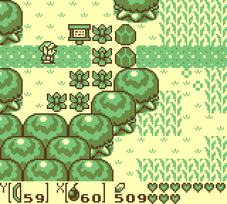
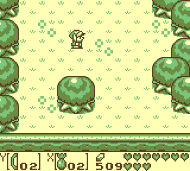

# Super Awakening

`Super Awakening` is a `Legend of Zelda: Link's Awakening` romhack for the `Super Game Boy`.  The romhack enables additional controls and new gameplay feature that are designed to be played with a `Super Nintendo` controller.

## Play now
* Download the IPS patch from the latest [Release](https://github.com/cphartman/super-awakening/releases)
* Load the patched rom into the [Super Awakening Emulator](https://cphartman.github.io/projects/super-links-awakening/).

## New Gameplay Features
* 🗡 Sword and Shield equipped to `A` / `B` buttons
* 💣 Items equipped to `X` / `Y` buttons 
* 🏹 Change items with `R` / `L` buttons
* 💼 Customizable item inventory
* 💨 Quick dash
* 💪 Quick lift
* 💰 Quick restock

### Expanded controls
Your sword and shield are equipped to `A` and `B`.  There are 2 different items equipped to `X` and `Y`.  The items currently equipped to `X` and `Y` are displayed on screen during gameplay.  

### Change Items
Use the shoulder buttons to change either equipped item.
* Press `L` to change the item in `Y`
* Press `R` to change the item in `X`
* Use `L+Y` or `R+X` to change to previous item

### Customizable item inventory
The pause menu allows you to customize your inventory.  Your inventory is used during gameplay to change between items.

You have 10 inventory slots.  Each inventory slot can have a different item.  An inventory slot can also be set to empty.  
* Press `Start` to open inventory menu
* Use `Arrow Keys` to select an inventory slot
* Press `A` or `B` to change item in the selected inventory slot

### Quick Dash
Double tap any direction to automatically start a dash.

### Quick Lift
Push against a heavy object and press `X` or `Y` to automatically lift the object.  Equip the `Power Bracelet` to lift other objects.

### Quick Restock
Spend rupees to automatically restock empty consumable items.

## Technical Background
The `Super Game Boy` system exposes up to [4 controller inputs](https://gbdev.io/pandocs/Joypad_Input.html#usage-in-sgb-software) for `Game Boy` games.  This feature enables local multiplayer for `Game Boy` games.

| Street Fighter 2 | Bomberman |
| ---- | ---- |
|  |  |

The `Super Game Boy` forwards button inputs from the `Super Nintendo` to button inputs on the `Game Boy`.  The `Game Boy` controller can only support 8 buttons.  As a result, the additional `X/Y/R/L` buttons on the `Super Nintendo` controller are not sent to the `Game Boy`.

The romhack instructs the `Super Game Boy` to send the controller 1 `X/Y/R/L` buttons to the `Game Boy` controller 2 as `A/B/Left/Right` buttons.  This allow a single `Super Nintendo` controller to send all 12 button inputs to the `Game Boy`.  The romhack implements custom functionality for the additional controller inputs.

## System Compatibility
The romhack is fully supported on an original `Super Nintendo` system using a `Super Game Boy`.  `Game Boy Color` is supported in emulators where available.  Some emulators require additional configurations to set the `X/Y/R/L` buttons to controller 2.

| System | Compatibility | Notes |
| ---- | ---- | ---- | 
| Super Nintendo | ✅ |  `SuperNt`+`SGB1`+`EverDrive-GBx7` |
| Analogue Pocket | ✅ | [`Spiritualized.SuperGB`](https://github.com/spiritualized1997/openFPGA-Super-GB) core |
| Web Browser| ✅ | [`EmulatorJS` + `mGBA` fork](https://cphartman.github.io/projects/super-links-awakening/) |
| BGB | 🌈 | Set `Emulated System` to `SGB + GBC`. Set `X/Y/L/R` button inputs to `A/B/Left/Right` on joypad1. |
| Mesen | ✅ | Set `Game Boy model` to `Super Game Boy`. Set buttons for `SNES Port 1 Controller`. |
| bsnes | ✅ | Load SGB sfc, then load patched rom. |
| mGBA, Retroarch | ❌ | Does not support Controller 2 inputs |

## Issue List
* Like-Like does not steal shield
* Must equip and press item button when entering shops or interacting with NPCs
* Piece of Power drops less frequently and will overlap Item Y on pickup

## Build Instructions

Run `make build`

### Dependencies:
* Python 3
* [rgbds](https://github.com/rednex/rgbds#1-installing-rgbds)
* [cc65](https://github.com/cc65/cc65)

## Acknowledgements

Thanks to all the developers who contributed to the [LADX Dissasembly](https://github.com/zladx/LADX-Disassembly/) and the [SGB Bios Dissasembly](https://github.com/ISSOtm/sgb-bios).  This romhack is only possible because of their work.
