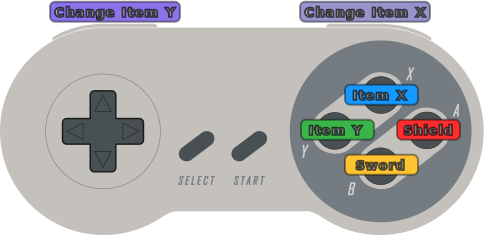
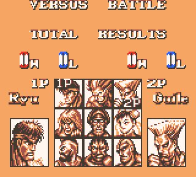
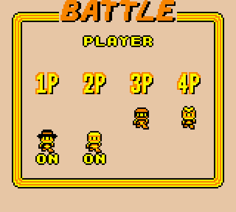
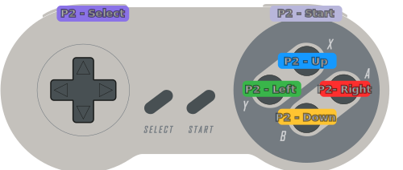

# Super Link's Awakening

`Super Link's Awakening` is a `Legend of Zelda: Link's Awakening` romhack that enables additional gameplay functionality by using `Super Game Boy` functions.  The new gameplay features are designed to be played with an SNES controller.

## Play now
Load the rom file into the [Super Links Awakening Emulator.](https://cphartman.github.io/projects/super-links-awakening/)

## New Gameplay Features
* 🗡 Sword equipped to `B` button
* ⛨ Shield equipped to `A` button
* 💣 Items equipped to `X` and `Y` buttons 
* 🏹 Switch items with `R` and `L` buttons
* 💼 Custom item inventory system

### Custom Item Inventory System
Use the shoulder buttons to quickly change though the items in your inventory.  Create a custom inventory of items to use in gameplay.

### Gameplay Controls
The sword and shield are automatically equipped to `A` and `B`.  There are 2 different items equipped to `X` and `Y` .  The items currently equipped are displayed on screen during gameplay.  Use the shoulder buttons to change either equipped item.
* Press `L` to change the item in `Y`
* Press `R` to change the item in `X`
* Use `L+Y` or `R+X` change to previous item

### Pause / Inventory Menu Controls
The pause menu allows you to create your inventory.  Your inventory is used during gameplay to change between items.

Your inventory has 10 different slots.  Each slot can have a different item.  A slot can also be set empty.  
* Use `arrow keys` to select a slot.
* Press `R` to change selected slot to the next item.
* Press `L` to change selected slot to the previous item.

## How?
The `Super Game Boy` exposes up to [4 controller inputs](https://gbdev.io/pandocs/Joypad_Input.html#usage-in-sgb-software) to the `Game Boy` system.  This feature enabled local multiplayer with the `Super Game Boy` for some games.

| Street Fighter 2 | Bomberman |
| ---- | ---- |
|  |  |

The romhack takes advantage of this functionality by configuring a single IRL controller to use buttons for both `Super Game Boy` controllers inputs.  This double the number of inputs available for the game to use. The romhack implements custom functionality for the additional controller 2 inputs.

## Setup

* This romhack must be played using a `Super Game Boy`
* `Super Game Boy` Controller 1 and Controller 2 should both map to a single `IRL controller`.

### Controller Mapping

`IRL Controller` is the physical controller used to play the romhack.  `SGB Controller` is the controller input for the `Super Game Boy` system.

| IRL Controller  | SGB Controller | SGB Button |
| ------------- | ------------- | ------------- |
| `Up` | Player 1 |  `Up`  |
| `Down` | Player 1 |  `Down`  |
| `Left` | Player 1 |  `Left`  |
| `Right` | Player 1 |  `Right`  |
| `Start` | Player 1 |  `Start`  |
| `Select` | Player 1 |  `Select`  |
| `A` | Player 2 |  `Right`  |
| `B` | Player 2 |  `Down`  |
| `X` | Player 2 |  `Up`  |
| `Y` | Player 2 |  `Left`  |
| `R` | Player 2 |  `Start`  |
| `L` | Player 2 |  `Select`  |

*Diagram showing the `IRL Controller` with `SGB Controller` button mapping*

### Unused `Super Game Boy` controller buttons
The `A` and `B` buttons on both `SGB Controller 1` and `SGB Controller 2` are not used in the romhack.  Pressing `A` or `B` on `SBG Controller 1` will have unexpected results in the games.

## System Compatibility
| System | Compatibility | Notes |
| ---- | ---- | ---- |
| SNES | ✔️ | Use [Blueretro](https://github.com/darthcloud/BlueRetro) to map the `Src` controller to `Dest ID Output 2` |
| Mesen | ✔️ | Set `Gameboy` model to  `Super Game Boy`.  Map the required IRL controller/keyboard inputs to `SNES Port 2 Controller`. |
| BGB | ✔️ | Set `Emulated System` to  `Super Gameboy`.  Map the required IRL controller/keyboard inputs to `joypad1`. |
| EmulatorJS | ✔️* | [Custom fork here](https://github.com/cphartman/super-awakening-emulator) |
| mGBA | ❌ | Does not support Player 2 |
| Retroarch | ❌ | Crashes with `mgba`, `mesen-s`, and `gambatte` cores |
| Analogue Pocket | ❌ | `Spiritualized.SuperGB` core does not support controller remapping |

## Limitations
* All items always available.  Item Progression is not tracked for new games.
* Inventory does not save