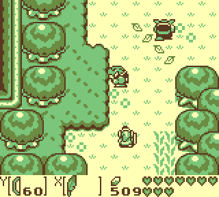
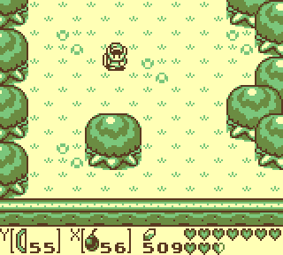
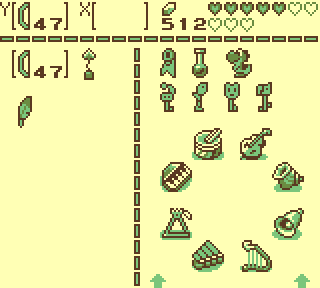
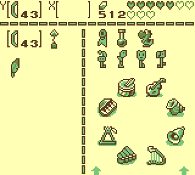
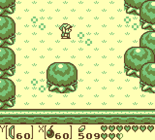

# Super Link's Awakening

`Super Link's Awakening` is a `Legend of Zelda: Link's Awakening` romhack that enables additional gameplay functionality by using `Super Game Boy` functions.  The new gameplay features are designed to be played with an SNES controller.

## Play now
* Download the IPS patch from the latest [Release](https://github.com/cphartman/super-awakening/releases)
* Load the patched rom into the [Super Links Awakening Emulator.](https://cphartman.github.io/projects/super-links-awakening/)

## New Gameplay Features
* 🗡 Sword and Shield equipped to `A` / `B` buttons
* 💣 Items equipped to `X` / `Y` buttons 
* 🏹 Change items with `R` / `L` buttons
* 💼 Customizable item inventory
* 💨 Quick dash

### Expanded controls
Your sword and shield are equipped to `A` and `B`.  There are 2 different items equipped to `X` and `Y` .  The items currently equipped to `X` and `Y` are displayed on screen during gameplay.  

### Change Items
Use the shoulder buttons to change either equipped item.
* Press `L` to change the item in `Y`
* Press `R` to change the item in `X`
* Use `L+Y` or `R+X` change to previous item

### Customize inventory items
The pause menu allows you to create your inventory.  Your inventory is used during gameplay to change between items.

Your inventory has 10 different slots.  Each slot can have a different item.  A slot can also be set empty.  
* Press `start` to open inventory menu
* Use `arrow keys` to select an inventory slot
* Press `R` to change selected inventory slot to the next item
* Press `L` to change selected inventory slot to the previous item

### Quick Dash
Double tap any direction to automatically start a dash

## How?
The `Super Game Boy` exposes up to [4 controller inputs](https://gbdev.io/pandocs/Joypad_Input.html#usage-in-sgb-software) to the `Game Boy` system.  This feature enables local multiplayer for `Game Boy` games.

| Street Fighter 2 | Bomberman |
| ---- | ---- |
|  |  |

The romhack takes advantage of this functionality by configuring a single IRL controller to use buttons for both `Super Game Boy` controllers inputs.  This double the number of inputs available for the game to use. The romhack implements custom functionality for the additional button inputs.

## Setup

* This romhack must be played using a `Super Game Boy`
* `Super Game Boy` Controller 1 and Controller 2 should both map to a single `IRL controller`.

### Controller Mapping

`IRL Controller` is the physical controller used to play the romhack.  `SGB Controller` is the controller input for the `Super Game Boy` system.

| IRL Controller  | SGB Controller | SGB Button |
| ------------- | ------------- | ------------- |
| `Up` | Player 1 |  `Up`  |
| `Down` | Player 1 |  `Down`  |
| `Left` | Player 1 |  `Left`  |
| `Right` | Player 1 |  `Right`  |
| `Start` | Player 1 |  `Start`  |
| `Select` | Player 1 |  `Select`  |
| `A` | Player 2 |  `Right`  |
| `B` | Player 2 |  `Down`  |
| `X` | Player 2 |  `Up`  |
| `Y` | Player 2 |  `Left`  |
| `R` | Player 2 |  `Start`  |
| `L` | Player 2 |  `Select`  |

*Diagram showing the `IRL Controller` with `SGB Controller` button mapping*

### Unused `Super Game Boy` controller buttons
The `A` and `B` buttons on both `SGB Controller 1` and `SGB Controller 2` are not used in the romhack.  Pressing `A` or `B` on `SBG Controller 1` will have unexpected results in the games.

## System Compatibility
This rom hack is fully supported on on original hardware.  `Game Boy Color` support is experimental. 

| System | Compatibility | Color | Notes |
| ---- | ---- | ---- | ---- |
| SNES | ✅ | ❌ | Use [Blueretro](https://github.com/darthcloud/BlueRetro) to map the `Src` controller to `Dest ID Output 2` |
| Mesen | ✅ | ❌ | Set `Gameboy` model to  `Super Game Boy`.  Map the required IRL controller/keyboard inputs to `SNES Port 2 Controller`. |
| BGB | ✅ | ⚠️ | Set `Emulated System` to  `Super Gameboy`.  Map the experi IRL controller/keyboard inputs to `joypad1`. `SGB+GCB` experimental. |
| EmulatorJS | ⚠️ | ❌ | [Custom fork](https://github.com/cphartman/super-awakening-emulator) |
| mGBA | ❌ | ❌ | Does not support controller 2 remapping |
| Retroarch | ❌ | ❌ | Crashes with `mgba`, `mesen-s`, and `gambatte` cores |
| Analogue Pocket | ❌ | ❌ | `Spiritualized.SuperGB` does not support controller 2 remapping |

## Limitations
* All items are always available in the inventory
* Item Progression is not tracked when obtaining new items
* No save support
* Occasional audio glitches