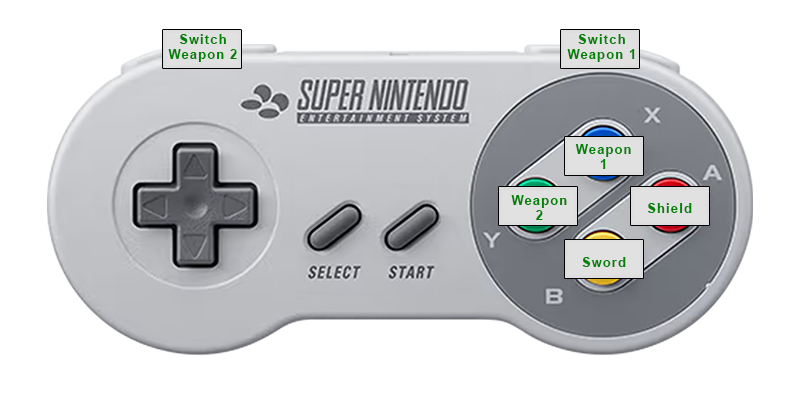
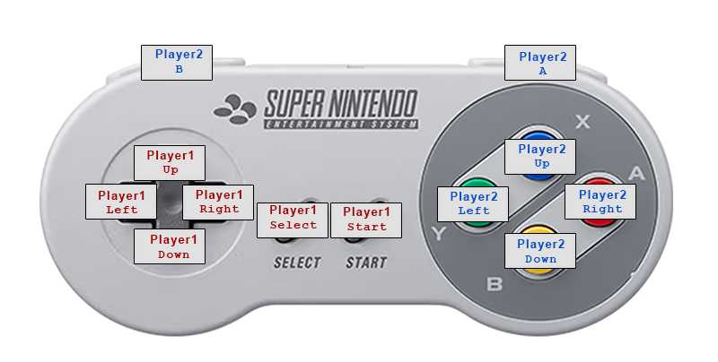

# Super Link's Awakening

`Super Link's Awakening` is a `Legend of Zelda: Link's Awakening` romhack that enables additional functionality using `Super Game Boy` features.  This romhack enables new gameplay features that are designed to be played with an SNES controller.

## Play now
Load the rom file into the [Super Links Awakening Emulator.](https://cphartman.github.io/projects/super-links-awakening/)

## New Gameplay Features
* 🗡 Sword always equipped to `B` button
* ⛨ Shield always equipped to `A` button
* 💣 Weapon inventory equipped to `X` and `Y` buttons 
* 🏹 Switch weapon inventory with `R` and `L` buttons
* 💼 Customizable inventory system

### Customizable Inventory System
Use the pause menu to build a custom inventory.  The inventory is used when toggling hotkey weapons.

### Gameplay Controls
The sword and shield are automatically equiped to the A and B buttons.  There are 2 hotkey items available with the X and Y buttons.  The items currently equiped to the hotkeys are displayed on screen in place of the original A/B items.  
* Press R to toggle hotkey X to the next inventory slot item.
* Press L to toggle hotkey Y to the next inventory slot item.
* Use R+X or R+Y to the previous inventory slot item.

### Pause / Inventory Menu Controls
The inventory menu allows you to configure up to 10 inventory slots.  Each inventory slot can have a different weapon or no weapon.  The inventory slots set which weapons are available when R or L is pressed during gameplay.
* Use arrow keys to select an inventory slot.
* Press R to change selected inventory slot to next item.
* Press L to change selected inventory slot to the previous item.

## How?
`Super Game Boy` exposes up to 4 controller inputs to `Game Boy` games.  This feature enabled local multiplayer via `Super Game Boy` for games like `Street Fighter 2` or `Bomberman`.

The romhack takes advantage of this functionality by configuring a single IRL controller to use buttons for both `Super Game Boy` controllers inputs.  This double the number of inputs available for the game to use. Custom functionality is implemented for each of the additional inputs.

## Setup

* This romhack must be played using a `Super Game Boy`
* Controller 1 and Controller 2 inputs for the `Super Game Boy` should both map to a single IRL controller

### Controller Mapping

**IRL Controller** is the the real life controller used to play the game.  **SGB Controller** is the input in to the `Super Game Boy`.

| IRL Controller  | SGB Controller | SGB Button |
| ------------- | ------------- | ------------- |
| `Up` | Controller 1 |  `Up`  |
| `Down` | Controller 1 |  `Down`  |
| `Left` | Controller 1 |  `Left`  |
| `Right` | Controller 1 |  `Right`  |
| `Start` | Controller 1 |  `Start`  |
| `Select` | Controller 1 |  `Select`  |
| `A` | Controller 2 |  `Right`  |
| `B` | Controller 2 |  `Down`  |
| `X` | Controller 2 |  `Up`  |
| `Y` | Controller 2 |  `Left`  |
| `R` | Controller 2 |  `Start`  |
| `L` | Controller 2 |  `Select`  |

*IRL Controller, with SGB Controller button mapping*

## Compatibility
| System | Compatibility | Notes |
| ---- | ---- | ---- |
| SNES | ✔️ | Confirmed |
| Mesen | ✔️ | Confirmed |
| BGB | ✔️ | Confirmed |
| EmulatorJS | ✔️* | [Custom fork here](https://github.com/cphartman/super-awakening-emulator) |
| Retroarch | ❌ | `mgba` core does not support Player 2 |
| Analogue Pocket | ❌ | `Spiritualized,SuperGB` core does not support controller remapping |

## Limitations
* All items always available.  Item Progression is not tracked for new games.
* Inventory does not save